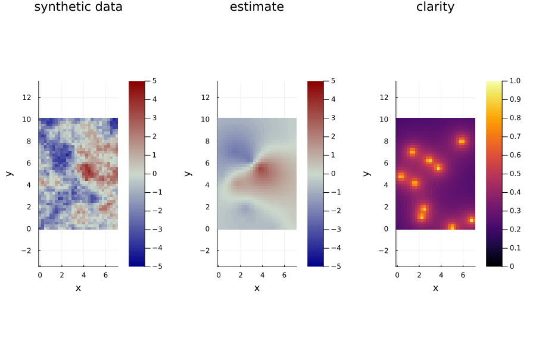

# SpatiotemporalGPs

[](https://dev10110.github.io/SpatiotemporalGPs.jl/stable/)
[](https://dev10110.github.io/SpatiotemporalGPs.jl/dev/)
[](https://github.com/dev10110/SpatiotemporalGPs.jl/actions/workflows/CI.yml?query=branch%3Amain)




## Testing

`cd` into this directory, and run `julia`. From inside the REPL do
```
] test
```

## Making Docs
To make docs locally, `cd` into this directory and run `julia`. From inside the REPL do 
```
using Revise
] activate docs
] resolve
include("docs/make.jl")
```
then from a new terminal, run a `LiveServer` to see the constructed docs:
```
julia -e 'using LiveServer; serve(dir="docs/build")'
```


