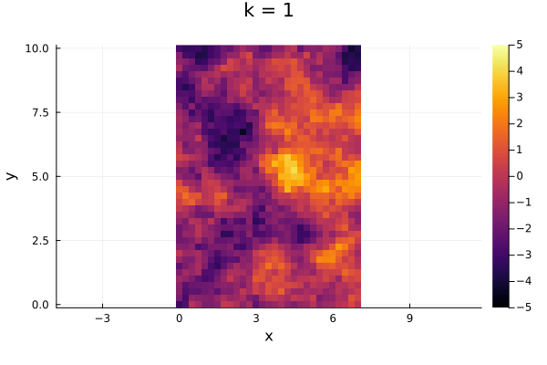
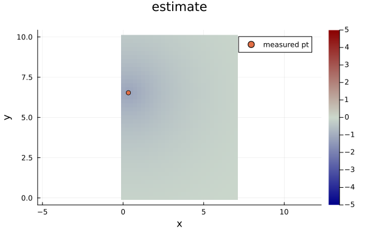
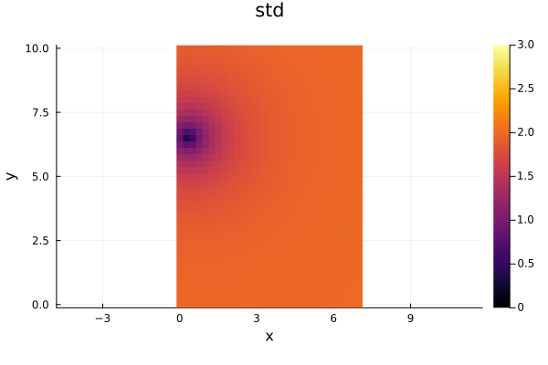
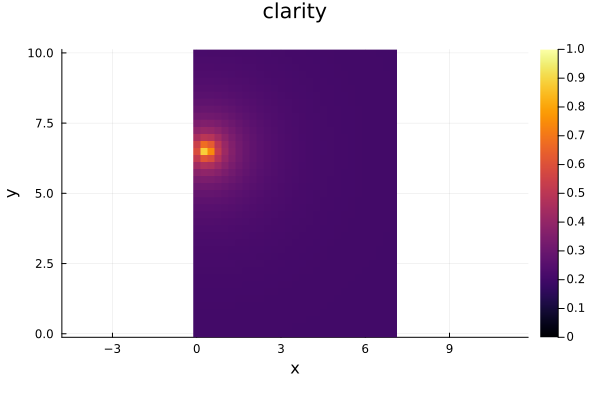
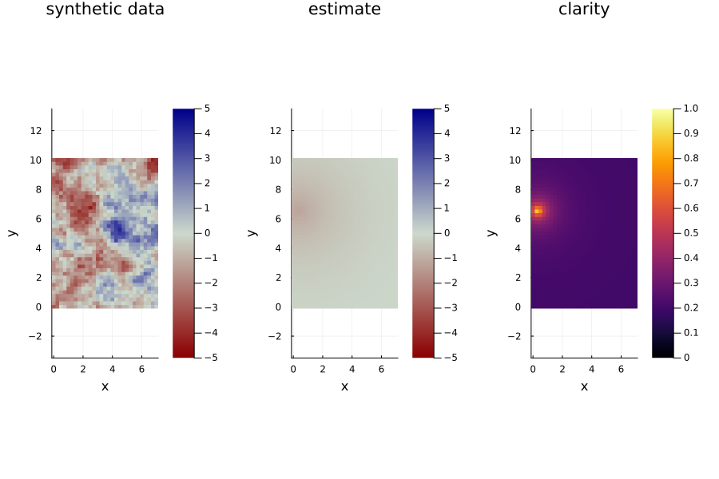
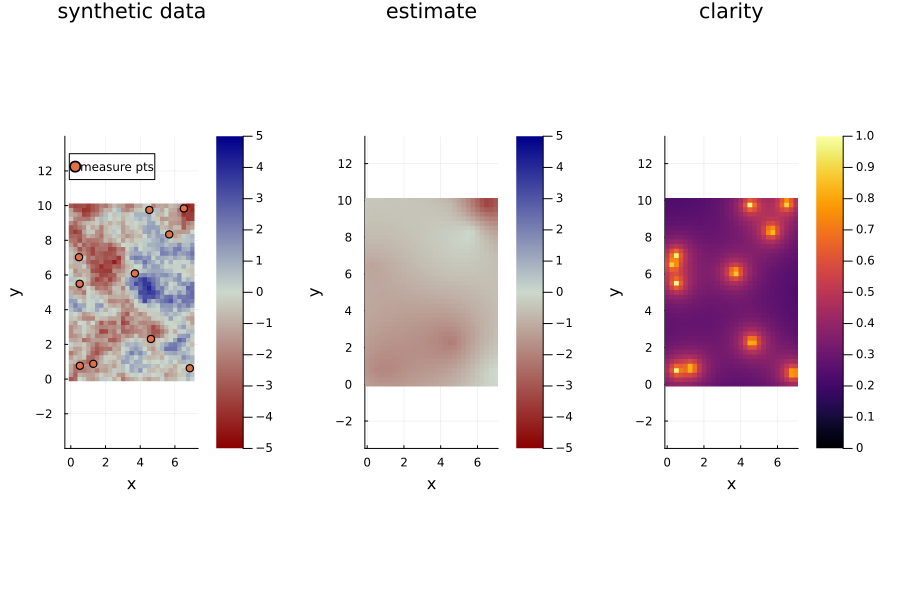
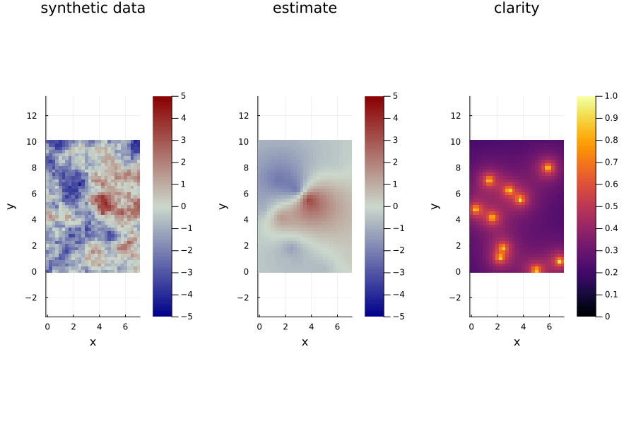
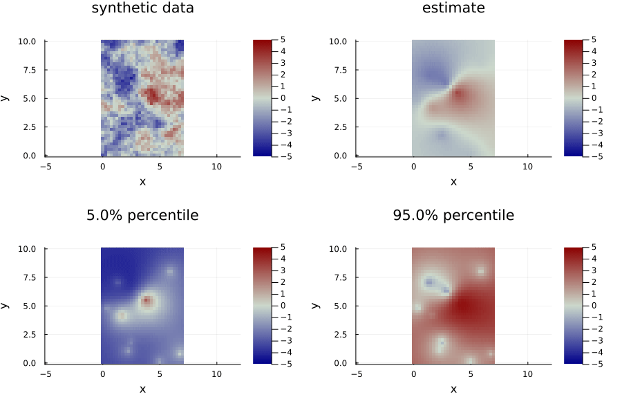
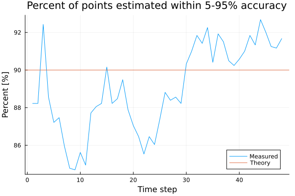

# Full Example with Synthetic Data


## Define the Problem
```julia
using SpatiotemporalGPs
using StaticArrays, LinearAlgebra, Plots
```


```julia
# setup the spatial and temporal kernels
σt = 2.0   # m/s
σs = 1.0   # m/s
lt = 3*60.0  # minutes
ls = 3.0   # km

kt = Matern(3/2, σt, lt)
ks = Matern(1/2, σs, ls)

# determine the temporal step size
Δt = 5.0 # minutes
Δx = 0.25 # km

# create the spatial domain
xs = 0:Δx:7.0
ys = 0:Δx:10.0

grid_pts = vec([@SVector[x, y] for x in xs, y in ys]);
```

## Create Synthetic Data

```julia
# let us generate the synthetic data first
tmax = 4 * 60.0 # minutes
synthetic_data = STGPKF.generate_spatiotemporal_process(xs, ys, Δt, tmax, ks, kt);

# visualize the ground truth data
@gif for k=1:length(synthetic_data.ts)
    heatmap(synthetic_data.xs, synthetic_data.ys, synthetic_data.data[:, :, k]', clims=(-5,5))
    title!("k = $k")
    xlabel!("x")
    ylabel!("y")
    plot!(aspect_ratio=:equal)
end
```




Lets start estimating...

## Initializing

```julia 
# Create the STGPKF Problem
problem = STGPKFProblem(grid_pts, ks, kt, Δt)

# Construct the state at time 0 conditioned on no measurements
state_initial = stgpkf_initialize(problem) 
```


## Correcting with measurements

```julia
# take some measurements
function rand_point(xs, ys)
    xmin, xmax = extrema(xs)
    ymin, ymax = extrema(ys)
    x = (xmax - xmin) * rand() + xmin
    y = (ymax - ymin) * rand() + ymin
    return @SVector [x, y]
end

function measure(data, x, y, t, σ_m=0.1)
    return data.itp(x, y, t) + σ_m *randn()
end

measure_pt = rand_point(xs, ys)
measure_σ = 0.1 # m/s
measure_y = measure(synthetic_data, measure_pt..., synthetic_data.ts[1], measure_σ);

# Do a correction
state_1_1 = stgpkf_correct(problem, state_initial, measure_pt, measure_y, measure_σ)

# plot the resulting state
plot(problem, state_1_1; plot_type=:estimate, clims=(-5, 5), cmap=:bluesreds, aspect_ratio=:equal)
scatter!([measure_pt[1]], [measure_pt[2]], label="measured pt")
```




```julia
plot(problem, state_1_1; plot_type=:std, clims=(0, 3), aspect_ratio=:equal)
```




```julia
plot(problem, state_1_1; plot_type=:clarity, clims=(0, 1), aspect_ratio=:equal)
```



## Predicting 

```julia
# propagate to the next time step
state_2_1 = stgpkf_predict(problem, state_1_1)

# plot
p0 = plot(synthetic_data, synthetic_data.ts[2]; clims=(-5, 5), cmap = :bluesreds, aspect_ratio=:equal)
title!("synthetic data")
p1 = plot(problem, state_2_1; plot_type=:estimate, clims=(-5, 5), cmap=:bluesreds, aspect_ratio=:equal)
p2 = plot(problem, state_2_1; plot_type=:clarity, clims=(0, 1), aspect_ratio=:equal)
plot(p0, p1, p2, layout=(@layout [a b c]), size=(900, 600))
```




## Measuring multiple points


```julia
# measure at a 10 different points at the same time
measure_pts = [rand_point(xs, ys) for i=1:10]
measure_ys = [measure(synthetic_data, pt..., synthetic_data.ts[2], measure_σ) for pt in measure_pts]
measure_Σ = (measure_σ^2) * I(10);

# do the KF correction
state_2_2 = stgpkf_correct(problem, state_2_1, measure_pts, measure_ys, measure_Σ)

# plot results
p0 = plot(synthetic_data, synthetic_data.ts[2]; clims=(-5, 5), cmap = :bluesreds, aspect_ratio=:equal)
title!("synthetic data")
scatter!(first.(measure_pts), last.(measure_pts), label="measure pts")
p1 = plot(problem, state_2_2; plot_type=:estimate, clims=(-5, 5), cmap=:bluesreds, aspect_ratio=:equal)
p2 = plot(problem, state_2_2; plot_type=:clarity, clims=(0, 1), aspect_ratio=:equal)
plot(p0, p1, p2, layout=(@layout [a b c]), size=(900, 600))
```



## Do a Whole Simulation

```julia
# initialize
state = stgpkf_initialize(problem) 

states = (typeof(state))[]

for k=1:length(synthetic_data.ts)

    @show k

    # make some measurements
    measure_pts = [rand_point(xs, ys) for i=1:10]
    measure_ys = [measure(synthetic_data, pt..., synthetic_data.ts[k], measure_σ) for pt in measure_pts]
    measure_Σ = (measure_σ^2) * I(10);

    # do the KF correction
    state_correction = stgpkf_correct(problem, state, measure_pts, measure_ys, measure_Σ)

    # add it to the states
    push!(states, state_correction)

    # do a prediction
    state = stgpkf_predict(problem, state_correction)

end
```


Animate the results!

```julia
@gif for k=1:length(states)
    p0 = plot(synthetic_data, synthetic_data.ts[k]; clims=(-5, 5), cmap = :bluesreds, aspect_ratio=:equal)
    title!("synthetic data")
    p1 = plot(problem, states[k]; plot_type=:estimate, clims=(-5, 5), cmap=:bluesreds, aspect_ratio=:equal)
    p2 = plot(problem, states[k]; plot_type=:clarity, clims=(0, 1), aspect_ratio=:equal)
    plot(p0, p1, p2, layout=(@layout [a b c]), size=(900, 600))
end
```



```julia
@gif for k=1:length(states)
    p0 = plot(synthetic_data, synthetic_data.ts[k]; clims=(-5, 5), cmap = :bluesreds, aspect_ratio=:equal)
    title!("synthetic data")
    p1 = plot(problem, states[k]; plot_type=:estimate, clims=(-5, 5), cmap=:bluesreds, aspect_ratio=:equal)
    
    p2 = plot(problem, states[k]; plot_type=:percentile, percentile=0.05, clims=(-5, 5), cmap=:bluesreds, aspect_ratio=:equal)

    p3 = plot(problem, states[k]; plot_type=:percentile, percentile=0.95, clims=(-5, 5), cmap=:bluesreds, aspect_ratio=:equal)
    
    plot(p0, p1, p2, p3, layout=(@layout [a b; c d]), size=(900, 600))
end
```



Check if the data is within the estimate

```julia
tol = 0.1

fs = Float64[]
for k=1:length(states)
    M_05 = STGPKF.get_estimate_percentile(problem, states[k], tol/2)
    M_95 = STGPKF.get_estimate_percentile(problem, states[k], (1 - tol/2))
    M_true = vec(synthetic_data.data[:,:, k])
    f = sum(M_05 .<= M_true .<= M_95) / length(M_true)
    push!(fs, f)
end

plot(100*fs, label="Measured")
hline!([100*(1 - tol)], label="Theory")
xlabel!("Time step")
title!("Percent of points estimated within tol of accuracy")
ylabel!("Percent [%]")
```



